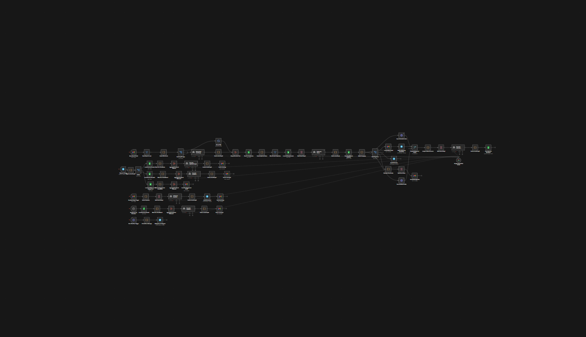

# 👤 Ghost Recruiter - AI Resume Screening

   

---

### 🛠 System Architecture

>## Why Ghost Recruiter?
> Recruiters spend 70% of their time on manual resume screening and repetitive follow-ups. Ghost Recruiter is an autonomous AI ecosystem that replicates the operations of an entire HR department by understanding context, verifying data, and continuously learning from its own decisions.

---

### 🧠 Core Intelligence

* **Deep Resume Scoring:** Advanced compatibility analysis using **Gemini 3.1 Flash** to evaluate seniority, soft skills, and experience consistency.
* **Background Verification (OSINT-light):** Autonomous checks across **LinkedIn & GitHub** to verify candidate activity and professional background.
* **Self-Optimization Loop:** The system's "heart" — monthly autonomous updates where the AI analyzes failed interviews and rewrites its own prompts to improve accuracy.
* **Empathetic Communication:** Native language detection (UA/PL/EN) and a "Smart Delay" system to maintain a professional, human-like HR brand.

---

### 🛡️ The "Recruitment Monster" Advantage

* **100% Autonomous Operation:** The system runs 24/7, processing incoming emails in seconds and building a comprehensive candidate database in real-time.
* **Cognitive Integrity Check:** AI cross-references dates and skills to identify "hidden gaps" in experience that human recruiters often overlook.
* **Unlimited Scalability:** Whether you receive 10 or 1,000 resumes daily, the n8n architecture handles any volume without compromising analysis quality.
* **Dynamic Knowledge Base:** Integrated with "Company Policy," the bot autonomously answers candidate questions about benefits and schedules.
* **Psychological Precision:** The "Smart Delay" system ensures every interaction feels personalized, maintaining a high-tier employer brand.

---

### 💸 ROI & Business Impact

* **Time-to-Hire Reduction:** Cut your hiring cycle by **60-80%** with instantaneous screening and automated scheduling via Calendly.
* **Cost Efficiency:** Replaces the workload of 2-3 Junior Recruiters during the initial sourcing and screening phase.
* **Data-Driven Decisions:** Receive a structured analytical map of every candidate, including ready-to-use "tough" interview questions.

---

### ⚙️ Technical Stack
* **Engine:** n8n (Enterprise Workflow Automation)
* **Cognitive Services:** Google Gemini 3.1 Flash (LLM)
* **Data Hub:** Google Sheets (Dynamic DB & Job Requirements)
* **Communication:** Telegram Bot API & Gmail API
* **Integrations:** LinkedIn Search, GitHub API, Calendly

---
[**👉 Get Full Access on Gumroad**](https://naroka.gumroad.com)

---

## 🚀 Quick Start / Setup Instructions
* **Import the Workflow:** Upload Ghost Recruiter - AI Resume Screening+ (2).json into your n8n environment (version 1.0 or newer).

* **Connect Integrations:** Connect your credentials for access to Gmail and Google Sheets (via OAuth2).

* **Set Up AI:** Insert your API Key from Google AI Studio into the Google Gemini node (using models/gemini-3.1-flash-lite-preview).

* **Configure Database:** Specify the target spreadsheet ID in the Load Job Requirements node (ensure it contains the columns: Requirements, Skills, Experience_Level, and Salary_Expectations).

* **Launch:** Click Active on the n8n control panel to start autonomous processing.

### Get in touch:

* 💬 **Telegram:** [t.me/nar00ka](https://t.me/nar00ka) — let’s discuss your idea in 10 minutes.
* 🐙 **GitHub:** https://github.com/nar0ka — explore my open-source projects.
* 📦 **Gumroad:** https://naroka.gumroad.com — check out ready-to-use workflows.
* [**WhatsApp:** https://wa.me/380632991898](https://wa.me/380632991898)

### 📄 Documentation Included (in the /README/ Folder)

* **Manual:** Ghost_Recruiter_Manual.pdf / Ghost_Recruiter_Manual_EN.pdf — Detailed setup and operational guide for all nodes.

* **Credentials Setup:** Credentials_Setup_Guide.pdf — Step-by-step instructions for obtaining API keys and configuring OAuth2.

* **System Prompts:** System_Prompt_Templates.pdf — Ready-to-use system prompt templates and data structures for the AI agent.

* **License and Support:** License_and_Support.pdf / License_and_Support_EN.pdf — Standard licensing terms for users.

* **Screenshots:** Examples of processed reviews and AI-generated feedback.
* 
### Get in touch:

* 💬 **Telegram:** [t.me/nar00ka](https://t.me/nar00ka) — let’s discuss your idea in 10 minutes.
* 🐙 **GitHub:** https://github.com/nar0ka — explore my open-source projects.
* 📦 **Gumroad:** https://naroka.gumroad.com — check out ready-to-use workflows.
* [**WhatsApp:** https://wa.me/380632991898](https://wa.me/380632991898)
---

### 💡 Bonus: If you are not sure where to start your automation journey, just drop me a message — I will help you identify which processes can be optimized today!

*Developed by [Naroka Studio](https://github.com/nar0ka)*
